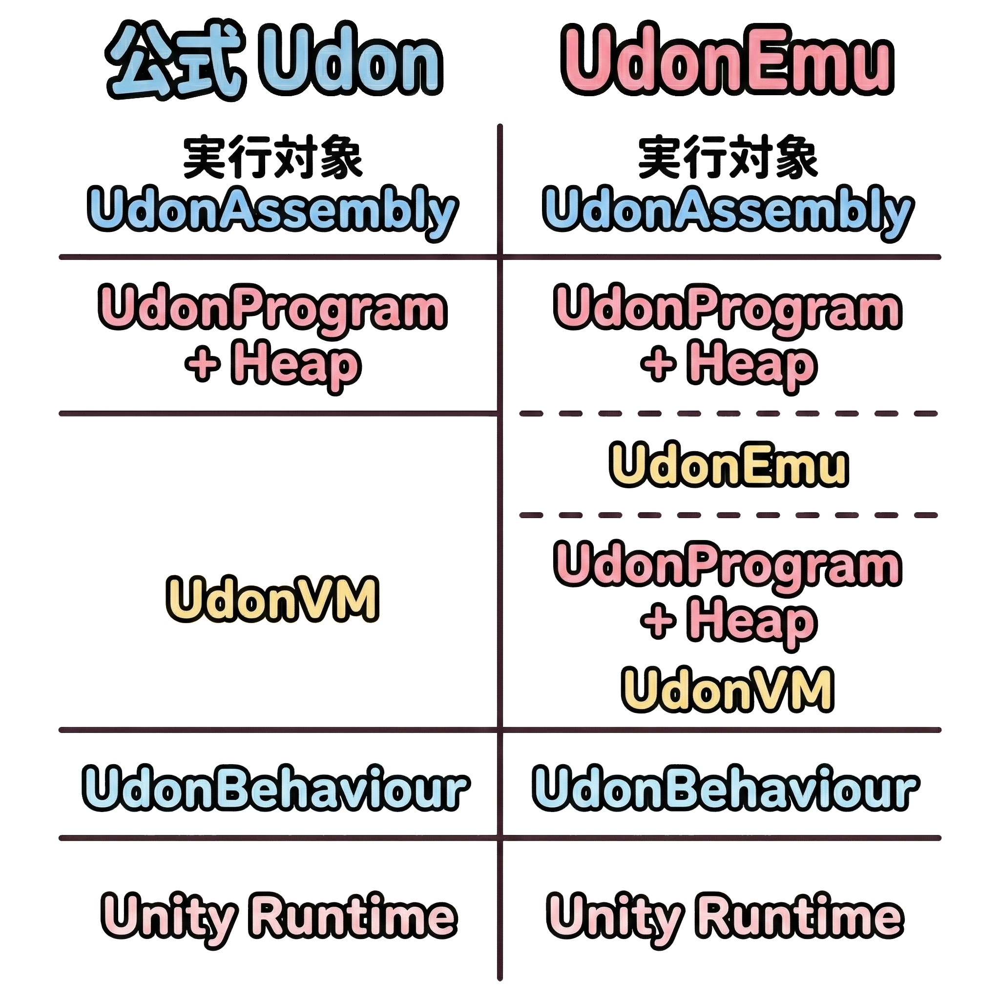

# 実行アーキテクチャの違い

公式 Udon と UdonEmu は、**UdonAssembly がどの階層で実行されるか**が異なります。  
この違いを理解すると「どこまでが公式の仕様で、どこからが UdonEmu の挙動か」を切り分けやすくなります。

---

## 用語の整理

このページで使用する用語を整理します。  
詳細は [公式ドキュメント: The Udon VM and Udon Assembly](https://creators.vrchat.com/worlds/udon/vm-and-assembly/) を参照してください。

| 用語 | 説明 |
|------|------|
| **UdonBehaviour** | Unity の MonoBehaviour コンポーネント。イベントの入口になる |
| **UdonVM** | Udon の命令（バイトコード）を実行する仮想マシン |
| **UdonAssembly** | Data Section（変数定義）と Code Section（命令列）からなるテキスト形式 |
| **UdonProgram** | UdonAssembly から組み立てられた実行可能形式 |
| **Heap** | 実行時の値（変数・一時値など）を格納する領域 |

---

## Udon と UdonEmu の比較

公式 Udon では、**UdonBehaviour のイベントが入口**になり、**UdonVM がプログラムを直接実行**します。  
UdonEmu は、**公式 UdonVM 上で動く Udon プログラム**として実装されています。  
UdonEmu が内部でさらに **UdonAssembly を解釈・実行**するため、**子階層のレイヤー**が存在します。


<!-- 
```text
        公式 Udon                 │        UdonEmu
──────────────────────────────────┼──────────────────────────────────
                                  │  実行対象 UdonAssembly
                                  ├──────────────────────────────────
                                  │  UdonProgram + Heap
                                  ├╌╌╌╌╌╌╌╌╌╌╌╌╌╌╌╌╌╌╌╌╌╌╌╌╌╌╌╌╌╌╌╌╌╌
  実行対象 UdonAssembly            │  UdonEmu
──────────────────────────────────┼╌╌╌╌╌╌╌╌╌╌╌╌╌╌╌╌╌╌╌╌╌╌╌╌╌╌╌╌╌╌╌╌╌╌
  UdonProgram + Heap              │  UdonProgram + Heap
──────────────────────────────────┼──────────────────────────────────
  UdonVM                          │  UdonVM
──────────────────────────────────┼──────────────────────────────────
  UdonBehaviour                   │  UdonBehaviour
──────────────────────────────────┼──────────────────────────────────
  Unity Runtime                   │  Unity Runtime
══════════════════════════════════╧══════════════════════════════════
``` -->

---

## ポイント

### UdonEmu は「置き換え」ではない

UdonEmu は公式 Udon の **上で動く** ツールです。  
公式 UdonVM の制約（使用可能な EXTERN、型、Heap のルールなど）は **そのまま模倣**します。

### 互換性と差異

UdonEmu は可能な限り公式 Udon の動作を再現していますが差異が生じる場合があります：

- パフォーマンス特性の違い
- エラーハンドリングのタイミング

詳細は [互換性と差異](./compatibility.md) を参照してください。

---

## 関連ドキュメント

- [公式: The Udon VM and Udon Assembly](https://creators.vrchat.com/worlds/udon/vm-and-assembly/)
- [実行フローの理解](./execution-flow.md)
- [互換性と差異](./compatibility.md)
- [Dump](../debug/dump.md)
- [Opcode リファレンス](../debug/opcode.md)
